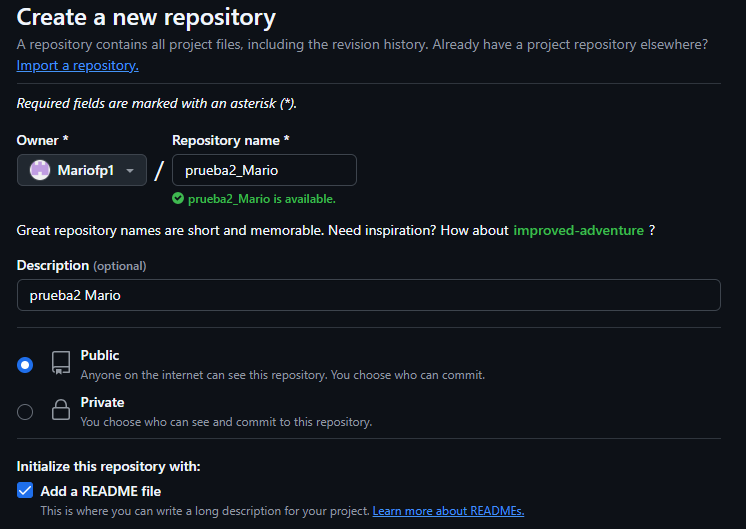
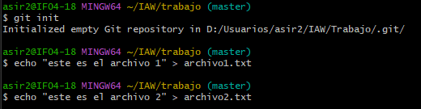
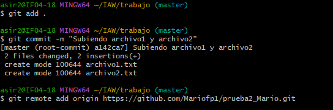
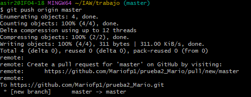
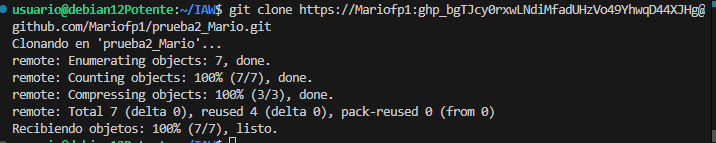
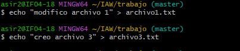
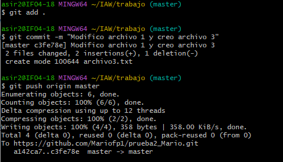
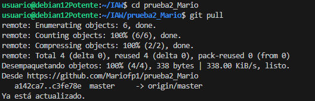

### Crear repositorio prueba2_tunombre

###  Creo el repositorio local y los dos archivos

### Conecto repositorio local con el remoto

### Subimos el repositorio local a GitHub

### Clonamos en Debian el repositorio de GitHub

### Modificamos archivo 1 y creamos archivo 3

### Lo añadimos al repositorio local, lo confirmamos y subimos a GitHub

### Actualizamos la versión local de Debian

